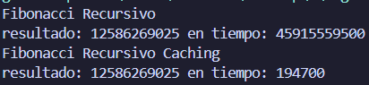

# Práctica Programación Dinámica

## 📌 Información General

- **Título:** Práctica 
- **Asignatura:** Estructura de Datos
- **Carrera:** Computación
- **Estudiante:** Pedro Pesántez
- **Fecha:** 16/07/2025
- **Profesor:** Ing. Pablo Torres
---

## 🛠️ Descripción

## 🚀 Ejecución

Para ejecutar el proyecto:

1. Compila el código:
    ```bash
    javac App.java
    ```
2. Ejecuta la aplicación:
    ```bash
    java App
    ```

---

## 🧑‍💻 Ejemplo de Entrada
