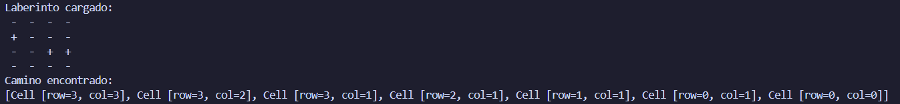

# Práctica Programación Dinámica

## 📌 Información General

- **Título:** Práctica 
- **Asignatura:** Estructura de Datos
- **Carrera:** Computación
- **Estudiante:** Pedro Pesántez
- **Fecha:** 16/07/2025
- **Profesor:** Ing. Pablo Torres
---

## 🛠️ Descripción
Este proyecto implementa una solución recursiva para resolver laberintos utilizando **backtracking**. El objetivo es encontrar un camino válido desde una celda inicial hasta una celda final en una matriz booleana que representa el laberinto.

- `true` indica una celda transitable.  
- `false` indica una pared o celda bloqueada.

### 🧱 Componentes principales

- **`Cell`**: Clase que representa una posición en el laberinto (fila y columna).
- **`MazeSolverRecursivo`**: Implementa el algoritmo de búsqueda recursiva, explorando las 4 direcciones posibles (arriba, abajo, izquierda, derecha) para encontrar un camino desde el inicio hasta el final.
- **`App`**: Clase principal que:
  - Crea un laberinto predefinido.
  - Ejecuta el algoritmo de resolución.
  - Imprime el laberinto.
  - Muestra el camino encontrado (del inicio al destino) en consola.

## 🚀 Ejecución

Para ejecutar el proyecto:

1. Compila el código:
    ```bash
    javac App.java
    ```
2. Ejecuta la aplicación:
    ```bash
    java App
    ```

---

## 🧑‍💻 Ejemplo de Entrada

---

---
